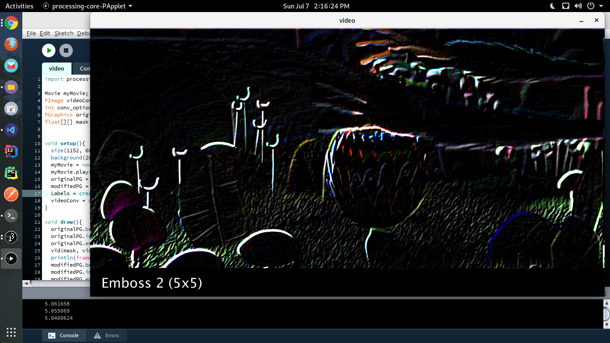
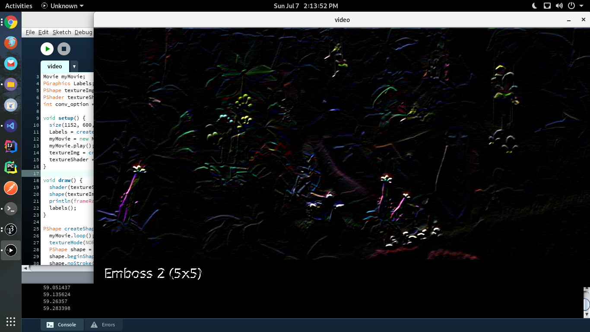

# Taller de shaders

## Propósito

Estudiar los [patrones de diseño de shaders](http://visualcomputing.github.io/Shaders/#/4).

## Tarea

1. Hacer un _benchmark_ entre la implementación por software y la de shaders de varias máscaras de convolución aplicadas a imágenes y video.
2. Implementar un modelo de iluminación que combine luz ambiental con varias fuentes puntuales de luz especular y difusa. Tener presente _factores de atenuación_ para las fuentes de iluminación puntuales.
3. (grupos de dos o más) Implementar el [bump mapping](https://en.wikipedia.org/wiki/Bump_mapping).

## Integrantes

Complete la tabla:

| Integrante | github nick |
|------------|-------------|
| Jhon Sedano| jhonsd1996  |
| David Rico | davidrh195  |

## Informe

1. El primer punto se estructuró de la siguiente manera:

Se tienen dos carpetas, una para realizar la ejecución sin shaders como en el taller 1 y la otra aplicando shaders. Se aplicaron 10 mascaras de convolución entre las cuales tenemos:
    
* Gaussian Blur (3x3)
* Box Blur (3x3)
* Motion Blur (9x9)
* Edge 1 (3x3)
* Edge 2 (3x3)
* Edge 3 (3x3)
* Sharpen 1 (3x3)
* Sharpen 2 (3x3)
* Emboss 1(3x3)
* Emboss 2 (5x5)

El framerate sin shaders oscila entre 2 y 6 fps dependiendo de la mascara de convolución que se use

El framerate con shaders oscila entre 58 y 61 fps sin importar el fragment shader que se use

Para cambiar entre mascaras y/o shaders se debe hacer uso de flecha izquierda - flecha derecha o los números del 0 al 9. Para regresar al video original se utiliza r/R.

2. Se tienen 2 carpetas en data para trabajar los shaders de la luz difusa y especular por separado.

Para cambiar entre luz difusa a especular se utiliza la barra espaciadora, para cambiar el enfoque de vertex a pixel se utiliza v/V y p/P respectivamente. Para cambiar la posicion de la luz se utilizan las flechas izquierda y derecha para cambiar la posición en el eje X, las flechas arriba y abajo para la posición en Y y +/- para la posición en Z es decir para alejarla o acercarla. Para retornar al valor por defecto(luz difusa en vertex cuya posicion es el centro del canvas alejada 200px) se utiliza r/R.

3. Se utilizaron 4 texturas correspondientes a una bola de golf, un pelota de basketball, otra de futból y otra de volleyball. Para observar el bump mapping se utiliza la tecla b/B.
Este bump mapping fue realizado utilizando una convolución tipo Emboss (5x5).

| -2|-1 |-1|-1|0|
|--|--|--|--|--|
|-1|-1|-1|0|1|
|-1|-1|1|1|1|
| -1|0|1|1|1|
| 0|1|1|1|2|

No se incluyen capturas de pantalla ya que el efecto se puede apreciar mejor al ejecutar el código.

## Entrega

Fecha límite ~~Lunes 1/7/19~~ Domingo 7/7/19 a las 24h. Sustentaciones: 10/7/19 y 11/7/19.